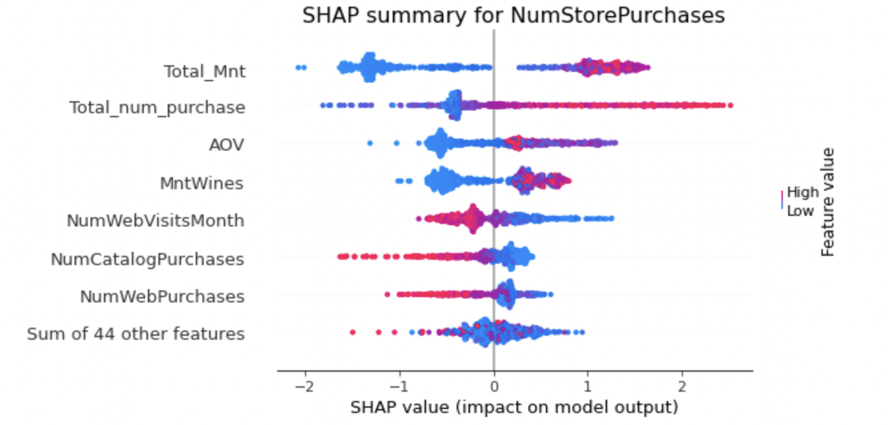

# Problem Statement
Being a data analyst at a marketing company, and the chief marketing officed told me that previous marketing campain have not been effective. So, I need to analyze the data to understand this problem and solve effectively.

# Brief
This idea was inpired from [this github repository](https://github.com/adiag321/CRM-Analysis-for-Marketing-data) with slightly modyfying the parameters and tried to analyzing different features in the dataset. Some of the work done is given below where we: 
1) Performed `Data Exploration` and `Segmentation` to study the key characteristic features of Potential customers using Python.
2) Executed `Hypothesis Testing`, `Statistical Analysis`, A`nomaly Detection` and `Trend Analysis`, and `Feature Engineering` to identify sequential demand patterns and Customer Behavior.
3) Calculated the top 10 Informative features using `Random Forest Feature` Importance.
4) Detected `Successful Marketing Channels` and `Underperforming Marketing Campaigns`.
5) Designed Interactive dashboards using Flourish to analyze the trends, give recommendations and publish the findings.

# Data Description
The dataset is collected from kaggle - https://www.kaggle.com/datasets/jackdaoud/marketing-data?taskId=2986

1. ID: Customer’s unique identifier
2. Year_Birth: Customer’s birth year
3. Education: Customer’s education level
4. Marital_Status: Customer’s marital status
5. Income: Customer’s yearly household income
6. Kidhome: Number of children in customer’s household
7. Tennhome: Number of teenagers in customer’s household
8. Dt_Customer: Date of customer’s enrollment with the company
9. Recency: Number of days since customer’s last purchase
10. MntWines: Amount spent on wine in the last 2 years
11. MntFruits: Amount spent on fruits in the last 2 years
12. MntMeatProducts: Amount spent on meat in the last 2 years
13. MntFishProducts: Amount spent on fish in the last 2 years
14. MntSweetProducts: Amount spent on sweets in the last 2 years
15. MntGoldProds: Amount spent on gold in the last 2 years
16. NumDealsPurchase: Number of purchases made with a discount
17. NumWebPurchase: Number of purchases made through the company’s website
18. NumCatalogPurchase: Number of purchases made using a catalog
19. NumStorePurchase: Number of purchases made directly in stores
20. NumWebVisitsMonth: Number of visits to company’s website in the last month
21. AcceptedCmp3: 1 if customer accepted the offer in the 3rd campaign, 0 otherwise
22. AcceptedCmp4: 1 if customer accepted the offer in the 4th campaign, 0 otherwise
23. AcceptedCmp5: 1 if customer accepted the offer in the 5th campaign, 0 otherwise
24. AcceptedCmp1: 1 if customer accepted the offer in the 1st campaign, 0 otherwise
25. AcceptedCmp2: 2 if customer accepted the offer in the 1st campaign, 0 otherwise
26. Response: 1 if customer accepted the offer in the last campaign, 0 otherwise
27. Complain: 1 if a customer complained in the last 2 years, 0 otherwise
28. Country: Customer’s location

# Analysis
**1) Marketing analysis**
**A) Data Cleaning:**
- Remove white spaces 
- Remove duplicates
- Replace duplicate value with (Median value)
- Data type conversion

**B) Exploratory data analysis(EDA)**
- Detect outliers
- Feature engineering
- Anomoly detection
- Correlation between features

**C) Statistical Analysis**
- Calculation `r` and `p` values
- Feature importance .png)

We can now see that the top 7 factors are:

1. Average order volume
2. Total amount spent in the last two years
3. Total number of purchases in the last two years
4. Amount spent on wine in the last 2 years
5. Number of purchases made using a catalog
6. Number of visits to company's web site in the last month
7. Total number of purchases through website in the last two years

However, we can’t tell whether each factor is positively or negatively correlated to the number of store purchases. We can use SHAP to explain it.

Finding:

1. The number of store purchases increases with the higher total amount spent(Total_Mnt), higher total purchase amount(Total_num_purchase), higher AOV, and higher amount of wines purchases(MntWines).
2. The number of store purchases decreases with more website visits(NumWebVisitsMonth), a higher number of purchases through the catalog(NumCatalogPurchases), and a higher number of purchases through websites(NumWebPurchases).
Summary: People who mostly shop at stores tend to buy more wines, have a higher average order volume, and shop less through the internet or catalog.

We got a Pearson correlation of 0.38 and a p-value of almost zero, which states that they are statistically significant and have a positive correlation. (If the p-value is > 0.05, we will fail to reject the null hypothesis, where they do not correlate.)

- **Amount of Omega 3 V/s Consumption by Couples who are Married and education status is PhD**

**D) Data Vizualization**

`Successfull marketing campaign`

